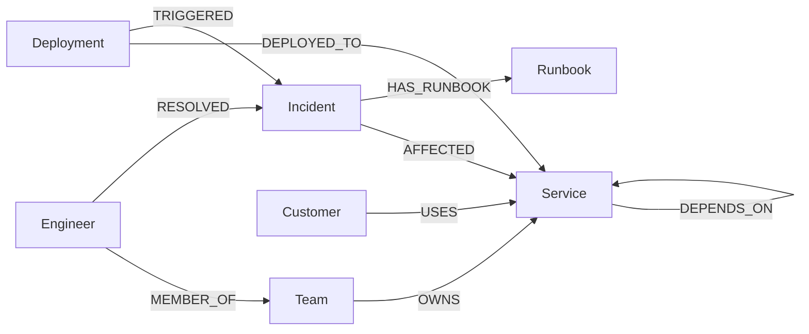
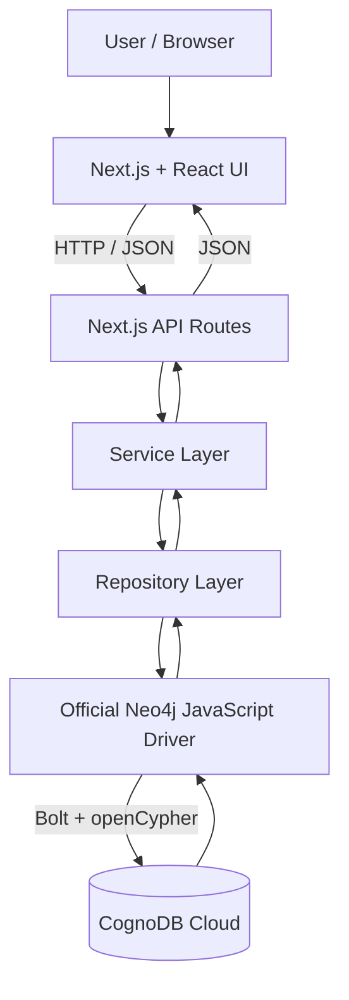
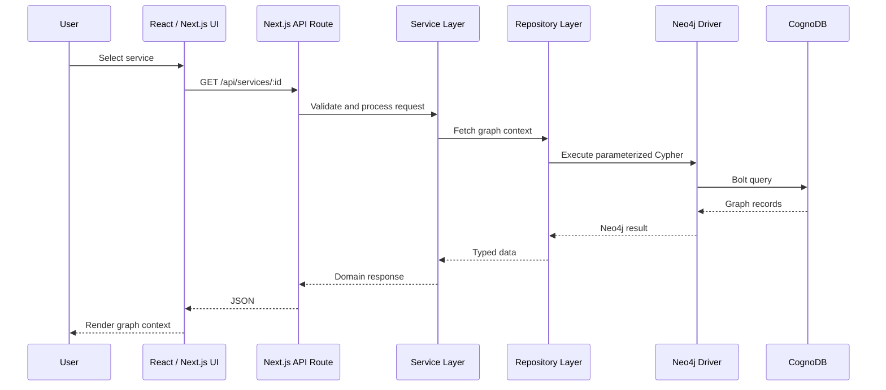
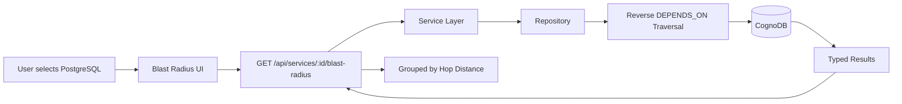
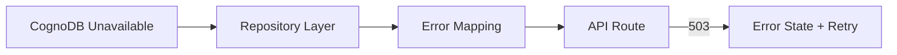
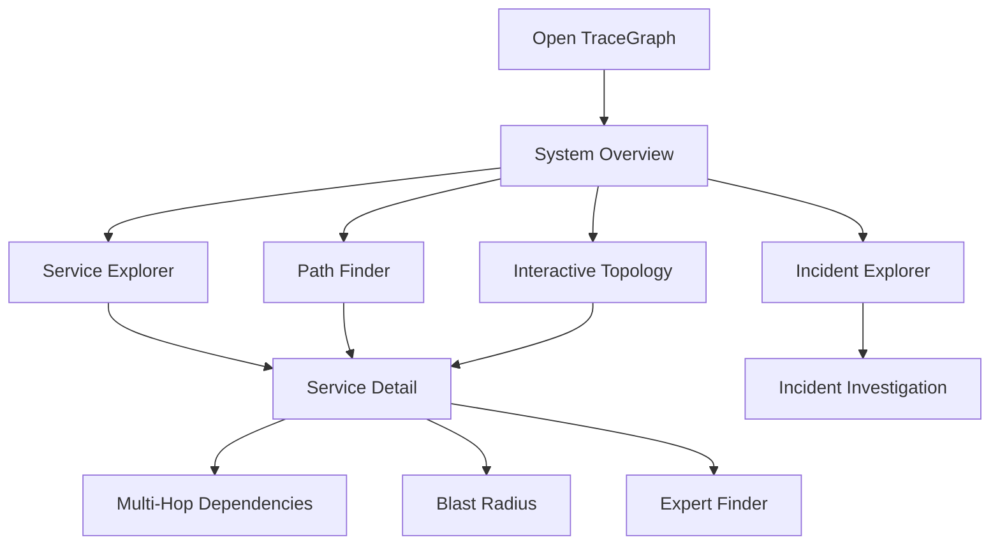

# TraceGraph — Software Incident & Dependency Intelligence

TraceGraph is a graph-powered software operations intelligence application for exploring service dependencies, investigating incidents, understanding blast radius, discovering dependency paths, and identifying engineers with relevant incident-resolution experience.

It is built as a complete full-stack application using **Next.js, React, TypeScript, CognoDB, openCypher, and the official Neo4j JavaScript driver**.

Instead of representing services, incidents, engineers, teams, deployments, customers, and runbooks as isolated records, TraceGraph models them as a connected operational graph.

---

## Submission Links

* **Live Demo:** https://trace-graph-software-incident-depen.vercel.app/
* **GitHub Repository:** https://github.com/akshaychavan23031998/TraceGraph-Software-Incident-Dependency-Intelligence
* **Screen Recording:** Add final recording URL before submission

---

# Why I Chose This Problem

I wanted to choose a problem where a graph database genuinely adds value rather than simply replacing a relational database.

Modern software systems are highly connected.

A payment service may depend on a database, a checkout service may depend on payments, an API gateway may depend on checkout, and multiple teams, incidents, deployments, engineers, customers, and runbooks may all be connected to those services.

During production incidents, engineers rarely ask questions about one isolated record.

They ask questions such as:

* What depends on the failing service?
* What could break if this database goes down?
* How does Service A eventually depend on Service B?
* Which deployment may have triggered this incident?
* Which team owns the affected system?
* Who has resolved related incidents in the past?
* Which customers may be impacted?

These are relationship-heavy questions involving traversal across multiple connections.

That made **software incident and dependency intelligence** a strong fit for a graph database and a meaningful use case for this assignment.

---

# What TraceGraph Solves

TraceGraph helps a user understand the operational relationships inside a software system.

For example:

```text
PostgreSQL Cluster
        ↑
  Payment Service
        ↑
 Checkout Service
        ↑
    API Gateway
```

If PostgreSQL fails, TraceGraph can perform reverse dependency traversal and answer:

> Which upstream services may be affected?

It can also answer:

> How does API Gateway eventually depend on PostgreSQL?

> Which deployment triggered a specific incident?

> Who owns the affected service?

> Which engineers have relevant incident-resolution experience?

> Which customers depend on impacted services?

These are naturally graph-shaped questions.

---

# Core Features

## 1. Operations Overview

The dashboard provides:

* total services,
* critical services,
* active incidents,
* resolved incidents,
* recent incidents,
* critical systems,
* CognoDB health status,
* graph intelligence shortcuts.

---

## 2. Service Explorer

Users can:

* browse services,
* search by name, description, or language,
* filter by criticality,
* open service details,
* inspect ownership,
* inspect direct dependencies,
* inspect dependents,
* explore multi-hop dependencies,
* preview blast radius,
* discover relevant engineers.

---

## 3. Incident Investigation

Incident pages include:

* severity,
* status,
* summary,
* affected services,
* service ownership,
* triggering deployment,
* resolver engineers,
* runbooks,
* investigation context.

---

## 4. Dependency Path Finder

Users can select two services and find the shortest dependency path between them.

Example:

```text
API Gateway
    ↓
Checkout Service
    ↓
Payment Service
    ↓
PostgreSQL Cluster
```

---

## 5. Blast Radius Analysis

Blast radius traverses dependencies in reverse.

If:

```text
API Gateway
    ↓
Checkout Service
    ↓
Payment Service
    ↓
PostgreSQL Cluster
```

and PostgreSQL fails, the potential impact becomes:

```text
PostgreSQL Cluster ❌
        ↑
 Payment Service
        ↑
Checkout Service
        ↑
   API Gateway
```

Affected services are grouped by hop distance.

---

## 6. Expert Finder

Instead of only asking:

```text
Who owns this service?
```

TraceGraph can ask:

```text
Which engineers previously resolved incidents
related to this service or nearby services?
```

This connects:

```text
Service
  ↓
Nearby Services
  ↓
Incidents
  ↓
Resolvers
  ↓
Engineers
```

---

## 7. Interactive Topology

The topology view visualizes service dependencies as a directed graph.

Features include:

* directed edges,
* service search,
* zoom,
* pan,
* fit-to-view,
* node selection,
* neighbor highlighting,
* edge highlighting,
* navigation to service details.

---

# Why a Graph Database?

The most important questions in TraceGraph are not about individual records.

They are about **connections**.

Examples:

```text
What does this service depend on?
```

```text
What depends on this service indirectly?
```

```text
What could break if this service fails?
```

```text
How does Service A eventually reach Service B?
```

```text
Which engineers have resolved incidents around this area of the graph?
```

These questions naturally involve variable-length traversal.

---

## Relational Approach

A relational model could contain tables such as:

```text
services
teams
engineers
incidents
deployments
customers
runbooks
service_dependencies
incident_services
team_services
engineer_incidents
```

Direct lookups would be straightforward.

However, multi-hop questions quickly become more complex.

Finding:

```text
Service A
  ↓
Service B
  ↓
Service C
  ↓
Service D
```

would require recursive SQL or repeated joins.

Blast radius becomes harder because traversal occurs in reverse and the number of hops is not known in advance.

Expert discovery may require joining:

```text
services
→ dependencies
→ incidents
→ engineers
→ teams
```

and ranking results based on graph proximity and historical resolution activity.

---

## Graph Approach

With CognoDB and openCypher, these relationships are first-class.

Conceptually:

```cypher
MATCH path =
  (service:Service)-[:DEPENDS_ON*1..6]->(dependency:Service)

RETURN path
```

Reverse traversal:

```cypher
MATCH path =
  (affected:Service)-[:DEPENDS_ON*1..8]->(failed:Service)

RETURN affected, length(path)
```

The graph model mirrors the operational domain directly.

This makes traversal easier to express, understand, extend, and maintain.

---

# Graph Data Model

TraceGraph uses seven main node labels.

| Node         | Purpose                                        |
| ------------ | ---------------------------------------------- |
| `Service`    | Application services and shared infrastructure |
| `Team`       | Teams responsible for services                 |
| `Engineer`   | Team members and incident responders           |
| `Incident`   | Production operational events                  |
| `Deployment` | Software releases                              |
| `Customer`   | Consumers of services                          |
| `Runbook`    | Incident-response documentation                |

---

## Data Model Diagram



Stable `id` properties are used for uniqueness constraints and idempotent seeding.

---

# Relationships

## `DEPENDS_ON`

```text
Service ──DEPENDS_ON──> Service
```

Represents service and infrastructure dependencies.

---

## `OWNS`

```text
Team ──OWNS──> Service
```

Connects operational ownership to services.

---

## `MEMBER_OF`

```text
Engineer ──MEMBER_OF──> Team
```

Connects engineers to their teams.

---

## `DEPLOYED_TO`

```text
Deployment ──DEPLOYED_TO──> Service
```

Associates deployments with services.

---

## `TRIGGERED`

```text
Deployment ──TRIGGERED──> Incident
```

Connects releases to incidents.

---

## `AFFECTED`

```text
Incident ──AFFECTED──> Service
```

Represents incident impact.

---

## `RESOLVED`

```text
Engineer ──RESOLVED──> Incident
```

Captures responder history.

---

## `USES`

```text
Customer ──USES──> Service
```

Connects customers to services.

---

## `HAS_RUNBOOK`

```text
Incident ──HAS_RUNBOOK──> Runbook
```

Connects incidents to response documentation.

---

# Why This Technology Stack?

The stack was intentionally kept focused so the project could demonstrate graph modeling, full-stack architecture, UI/UX, and deployment without unnecessary infrastructure.

---

## Next.js

Next.js was selected because it allows the frontend and backend API layer to live inside one TypeScript application.

Instead of:

```text
React Frontend
      ↓
Separate Express Server
      ↓
Database
```

TraceGraph uses:

```text
Browser
  ↓
Next.js UI
  ↓
Next.js API Routes
  ↓
Service / Repository Layer
  ↓
CognoDB
```

Benefits:

* one codebase,
* one deployment,
* shared TypeScript types,
* simpler architecture,
* server-side database access,
* clear API boundaries.

---

## React

React provides a component-driven UI architecture.

It is used for:

* service cards,
* incident cards,
* filters,
* loading states,
* error states,
* topology nodes,
* dependency paths,
* blast-radius results,
* navigation.

This keeps the interface reusable and maintainable.

---

## TypeScript

TypeScript makes the graph domain explicit.

Data flows through:

```text
CognoDB
  ↓
Repository
  ↓
Service Layer
  ↓
API
  ↓
Frontend
```

Types reduce mistakes between these layers and make the code easier to explain and refactor.

---

## CognoDB

CognoDB is the graph database used for the assignment.

It supports:

* openCypher,
* Bolt,
* official Neo4j drivers.

It is especially suitable here because the main operations involve:

* multi-hop traversal,
* reverse traversal,
* shortest paths,
* relationship-driven investigation.

---

## Official Neo4j JavaScript Driver

The project uses the official `neo4j-driver`.

It provides:

* Bolt connectivity,
* parameterized queries,
* session management,
* authentication,
* result handling.

No custom CognoDB SDK is required.

---

## React Flow

`@xyflow/react` powers the interactive topology.

It provides:

* graph nodes,
* edges,
* zoom,
* pan,
* fit-to-view,
* node selection,
* interaction.

This avoids implementing a graph canvas from scratch.

---

## Tailwind CSS

Tailwind CSS supports fast and consistent styling.

It helps with:

* responsive layouts,
* spacing,
* typography,
* cards,
* badges,
* navigation,
* UI states.

---

## Vercel

Vercel is used because TraceGraph is a single Next.js application.

The deployment includes:

* frontend pages,
* API Route Handlers,
* server-side Neo4j driver access.

No separate frontend and backend deployment is needed.

---

## ESLint

ESLint is used for static checks and code quality.

Verification commands include:

```bash
npm run lint
npm run build
```

---

# System Architecture

TraceGraph follows a layered architecture.



---

# Application Data Flow

A typical request follows this lifecycle.



The frontend never talks directly to CognoDB.

Database credentials remain server-side.

---

# Example Feature Flow — Blast Radius

Suppose PostgreSQL fails.

## Step 1

The user selects:

```text
PostgreSQL Cluster
```

---

## Step 2

The frontend calls:

```http
GET /api/services/svc-postgres/blast-radius
```

---

## Step 3

The API Route Handler validates the request.

---

## Step 4

The repository executes reverse traversal.

Conceptually:

```cypher
MATCH path =
  (affected:Service)
  -[:DEPENDS_ON*1..8]->
  (failed:Service {id: $serviceId})

RETURN affected, length(path)
```

---

## Step 5

CognoDB returns upstream services.

Example:

```text
API Gateway
  ↓
Checkout Service
  ↓
Payment Service
  ↓
PostgreSQL Cluster
```

---

## Step 6

The repository converts Neo4j records into typed JavaScript objects.

---

## Step 7

The API returns JSON.

---

## Step 8

The UI groups results by distance.

Example:

```text
1 hop
Payment Service

2 hops
Checkout Service

3 hops
API Gateway
```

---

## Blast Radius Request Diagram



---

# Project Structure

```text
TraceGraph/
│
├── scripts/
│   ├── seed.ts
│   ├── clear-db.ts
│   └── verify-seed.ts
│
├── src/
│   ├── app/
│   │   ├── api/
│   │   │   ├── health/
│   │   │   ├── incidents/
│   │   │   ├── paths/
│   │   │   ├── services/
│   │   │   └── topology/
│   │   │
│   │   ├── incidents/
│   │   ├── paths/
│   │   ├── services/
│   │   ├── topology/
│   │   ├── error.tsx
│   │   ├── loading.tsx
│   │   ├── layout.tsx
│   │   └── page.tsx
│   │
│   ├── components/
│   │   ├── dashboard/
│   │   ├── graph-explorer/
│   │   ├── incidents/
│   │   ├── services/
│   │   ├── topology/
│   │   └── ui/
│   │
│   ├── data/
│   │   └── seed-data.ts
│   │
│   ├── lib/
│   │   ├── api/
│   │   ├── config/
│   │   ├── db/
│   │   ├── errors/
│   │   ├── repositories/
│   │   └── services/
│   │
│   └── types/
│
├── docs/
│   └── screenshots/
│
├── .env.example
├── package.json
├── next.config.ts
├── tsconfig.json
└── README.md
```

---

# Project Structure Explained

## `src/app`

Contains Next.js App Router pages and backend Route Handlers.

---

## `src/app/api`

This is the backend HTTP boundary.

Main API areas include:

* `/api/health`
* `/api/services`
* `/api/incidents`
* `/api/paths`
* `/api/topology`

Route handlers validate requests, call backend logic, and return JSON.

---

## `src/components`

Contains reusable frontend components.

### `dashboard/`

Overview dashboard components.

### `services/`

Service catalog and service-detail UI.

### `incidents/`

Incident exploration and investigation UI.

### `graph-explorer/`

Path Finder and Blast Radius UI.

### `topology/`

Interactive topology components.

### `ui/`

Reusable UI states and shared presentation components.

---

## `src/lib`

Contains backend and application logic.

### `lib/api`

Shared API validation and response helpers.

### `lib/config`

Environment configuration.

### `lib/db`

CognoDB / Neo4j driver setup and database utilities.

### `lib/errors`

Typed application and database errors.

### `lib/repositories`

Contains Cypher queries.

This is the main graph-access layer.

### `lib/services`

Coordinates application logic between API routes and repositories.

---

## `src/data`

Contains deterministic realistic seed data.

---

## `src/types`

Contains domain and API TypeScript types.

---

## `scripts`

Contains database lifecycle scripts.

### `seed.ts`

Loads graph data.

### `verify-seed.ts`

Validates graph connectivity and seed results.

### `clear-db.ts`

Removes graph data manually.

---

# Local Setup

## 1. Clone the repository

```bash
git clone https://github.com/akshaychavan23031998/TraceGraph-Software-Incident-Dependency-Intelligence.git
```

Navigate into it:

```bash
cd TraceGraph-Software-Incident-Dependency-Intelligence
```

---

## 2. Install dependencies

```bash
npm install
```

---

# Create a CognoDB Instance

1. Visit:

```text
https://console.cognodb.com/signup
```

2. Create an account.

3. Create a free `c0` instance.

4. Choose a region.

5. Save the connection details.

CognoDB provides a URI similar to:

```text
bolt+s://<instance-id>.databases.cognodb.cloud
```

Default username:

```text
cognodb
```

Save the generated password securely because it may only be shown once.

---

# Environment Variables

Copy:

```text
.env.example
```

to:

```text
.env.local
```

Add:

```env
COGNODB_URI=bolt+s://<instance-id>.databases.cognodb.cloud
COGNODB_USERNAME=cognodb
COGNODB_PASSWORD=<your-password>
```

Never commit `.env.local`.

---

# Seed the Database

Run:

```bash
npm run db:seed
```

This creates:

* services,
* teams,
* engineers,
* deployments,
* incidents,
* customers,
* runbooks,
* relationships,
* uniqueness constraints.

Stable IDs and `MERGE` make repeated seeding safe.

---

# Verify Seed Data

Run:

```bash
npm run db:verify
```

This checks:

* graph connectivity,
* expected records,
* multi-hop paths,
* database access.

---

# Reset the Database

```bash
npm run db:clear
```

> Warning: this command deletes the seeded graph data.

It is never called automatically.

---

# Run Locally

```bash
npm run dev
```

Open:

```text
http://localhost:3000
```

---

# Health Endpoint

```bash
curl http://localhost:3000/api/health
```

Healthy response:

```json
{
  "status": "ok",
  "database": "connected"
}
```

Unavailable database:

```json
{
  "status": "degraded",
  "database": "unavailable"
}
```

Database credentials and stack traces are not exposed.

---

# Main Graph Queries

## Service Context

```http
GET /api/services/:id
```

Returns:

* service,
* owner,
* dependencies,
* dependents.

---

## Multi-Hop Dependencies

```http
GET /api/services/:id/dependencies?maxDepth=4
```

Conceptually:

```cypher
MATCH path =
  (service:Service {id: $serviceId})
  -[:DEPENDS_ON*1..4]->
  (dependency:Service)

RETURN path
```

The service ID is parameterized.

Traversal depth is validated against:

```text
1 | 2 | 3 | 4 | 5 | 6
```

---

## Blast Radius

```http
GET /api/services/:id/blast-radius
```

Conceptually:

```cypher
MATCH path =
  (affected:Service)
  -[:DEPENDS_ON*1..8]->
  (failed:Service {id: $serviceId})

RETURN affected, length(path)
```

---

## Dependency Path

```http
GET /api/paths?from=:serviceId&to=:serviceId
```

Returns the shortest bounded dependency path.

---

## Incident Investigation

```http
GET /api/incidents/:id
```

Connects:

```text
Deployment
   ↓
Incident
 ↙   ↘
Service Runbook
   ↑
 Team

Engineer ──RESOLVED──> Incident
```

---

## Expert Finder

```http
GET /api/services/:id/experts
```

Traverses:

```text
Service
  ↓
Nearby Services
  ↓
Incidents
  ↓
Resolvers
  ↓
Engineers
```

This is a strong example of a graph query that becomes awkward in a relational schema.

---

# Query Safety

User identifiers are passed as query parameters.

Example:

```cypher
MATCH (service:Service {id: $serviceId})
RETURN service
```

Request input is not directly concatenated into Cypher.

Traversal depth is selected only after closed-set validation.

---

# Error Handling

Database failures are mapped into safe application responses.



The UI supports:

* loading states,
* empty states,
* retry actions,
* missing-resource states,
* safe errors.

---

# UI / UX

TraceGraph is designed so a non-technical user can explore relationships without writing Cypher.

The interface includes:

* desktop navigation,
* responsive mobile navigation,
* searchable lists,
* filters,
* loading skeletons,
* empty states,
* error states,
* severity badges,
* criticality badges,
* topology visualization,
* cross-navigation between related entities.

---

# UI Screenshots

## System Overview


---

## Service Explorer


---

## Incident Investigation


---

## Path Finder


---

## Interactive Topology


---

# End-to-End User Flow



---

# Deployment Architecture

TraceGraph is deployed as one Next.js project on Vercel.

```text
Vercel
│
├── Next.js Frontend
│
├── Next.js API Routes
│
└── Server-Side Neo4j Driver
        │
        │ Bolt + openCypher
        ▼
    CognoDB Cloud
```

Required Vercel environment variables:

```env
COGNODB_URI
COGNODB_USERNAME
COGNODB_PASSWORD
```

These values remain server-side.

---

# Design Decisions and Tradeoffs

This project was built as a time-bounded take-home assignment, so the implementation focuses on demonstrating graph-native engineering clearly.

Key decisions include:

* bounded graph traversal instead of unlimited paths,
* deterministic seed data instead of live event ingestion,
* Next.js API Routes instead of a separate backend service,
* portable openCypher instead of APOC,
* deterministic topology layout instead of a dedicated layout service,
* realistic sample data instead of large-scale synthetic datasets,
* repository-based database access instead of queries scattered across routes.

These choices keep the codebase understandable while still showing an architecture that can evolve.

---

# Quality Checks

Before submission:

```bash
npm run lint
npm run build
npm run db:verify
```

Current status:

```text
Lint                 ✅ Passing
Production Build     ✅ Passing
TypeScript Check     ✅ Passing
CognoDB Production   ✅ Connected
Vercel Deployment    ✅ Live
```

---

# Production Smoke Test

Before final submission, verify:

* [ ] Live demo opens
* [ ] CognoDB shows connected
* [ ] Overview loads
* [ ] Services load
* [ ] Service details load
* [ ] Multi-hop dependencies work
* [ ] Blast radius works
* [ ] Expert finder works
* [ ] Incidents load
* [ ] Incident details load
* [ ] Path Finder works
* [ ] Topology loads
* [ ] Search works
* [ ] No console errors
* [ ] No failed API requests
* [ ] Mobile navigation works
* [ ] Screenshots render in README
* [ ] Screen recording link works

---

# Screen Recording Flow

A 3–5 minute walkthrough can show:

1. Overview
2. CognoDB connection
3. Service Explorer
4. Service dependencies
5. Multi-hop traversal
6. Blast radius
7. Expert finder
8. Incident Investigation
9. Path Finder
10. Interactive Topology
11. README graph model
12. Project architecture

Avoid exposing:

* `.env.local`
* CognoDB password
* Vercel environment values
* database credentials

---

# Future Improvements

Possible future extensions:

* historical dependency snapshots,
* customer-impact scoring,
* incident root-cause ranking,
* real-time event ingestion,
* deployment-risk scoring,
* AI-assisted incident investigation,
* graph anomaly detection,
* streaming service health,
* historical graph analytics.

These are intentionally outside the assignment scope.

---

# Author

**Akshay Ram Chavan**

GitHub:
https://github.com/akshaychavan23031998

Portfolio:
https://akshay-chavan-portfolio.vercel.app/

---

# Assignment

Built for the **Wexa AI CognoDB Graph Database Take-Home Assignment**.

The project demonstrates:

* thoughtful graph data modeling,
* graph-native query design,
* realistic seed data,
* multi-hop traversal,
* parameterized Cypher,
* clean full-stack architecture,
* intentional UI/UX,
* production-safe database access,
* deployment,
* and maintainable engineering structure.
